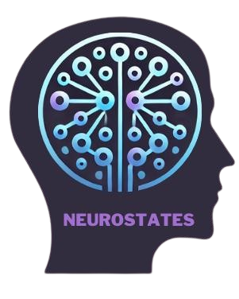

# NeuroStates



[](https://github.com/leliel12/diseno_sci_sfw)

**NeuroStates** is a Python package for detecting recurrent functional connectivity patterns (also known as brain states) and estimating their ocurrence probabilities in EEG and fMRI.

# Install
Before installing, make sure you have the following:
- Python 3.9 or later.
- pip (Python's package installer).
- A virtual environment (optional, but recommended).

From PyPI repo, simply run:
```bash
pip install neurostates
```
You can install it in development mode by running:
```bash
pip install -e .
```

# Basic Usage
To begin using **NeuroStates**, import the relevant module and call its funcitons as needed. Here's a simple example of how to use the basic functionality.

```python
### Example 1: Simple Task
import mymodule

# Call a function from the module
result = mymodule.some_function(parameter="value")

# Print the result
print(result)
```

# Documentation

# License

# Contact Us
<gabyarg25@gmail.com>
