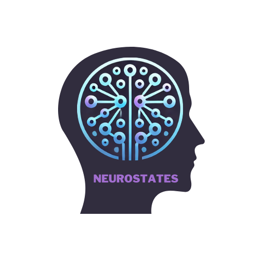

.. Neurostates documentation master file, created by
   sphinx-quickstart on Sun Feb 16 17:07:05 2025.
   You can adapt this file completely to your liking, but it should at least
   contain the root `toctree` directive.

Neurostates documentation
=========================

**Neurostates** is a Python package for detecting recurrent functional connectivity patterns (also known as brain states) and estimating their occurrence probabilities in EEG and fMRI.

.. toctree::
   :maxdepth: 2
   :caption: Contents:

   introduction
   installation
   usage
   contributing
   modules
   license
