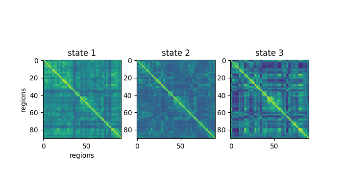
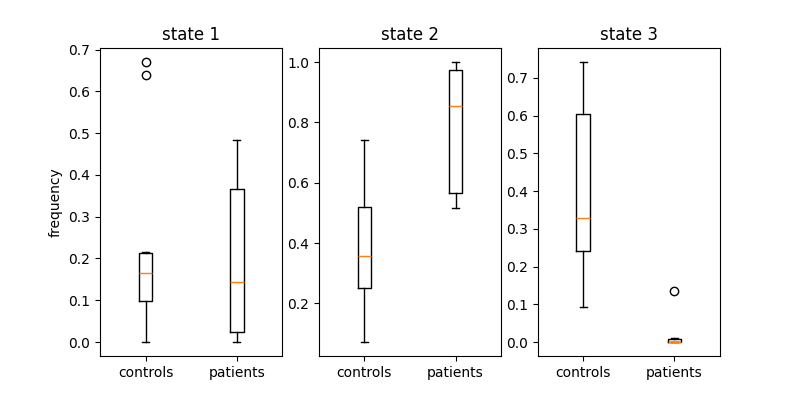

Usage
=====

This section provides examples of how to use **Neurostates**. Follow the instructions below to get started and make the most out of the package.

Basic Usage
------------

Overview
--------

In neuroscience research, a common setup involves comparing two or more groups — for example, **healthy controls** and **patients** — to uncover differences in brain dynamics. One powerful approach to characterize these dynamics is to extract **brain states** from functional connectivity patterns over time.

This page will walk you through the necessary steps to implement a brain states analysis with this library.

Step-by-step Example
--------------------

Load data
^^^^^^^^^

We load two groups of subjects — controls and patients — where each subject's data is a time series of brain activity (e.g., from fMRI or EEG).
It must be of size (subjects x regions x time)

.. code-block:: python

    import numpy as np
    import scipy.io as sio

    group_controls = sio.loadmat("path/to/control/data")["ts"]
    group_patients = sio.loadmat("path/to/patient/data")["ts"]

    groups = {
        "controls": group_controls,
        "patients": group_patients
    }

    print(f"Control group shape (subjects, regions, time): {group_controls.shape}")
    print(f"Patient group shape (subjects, regions, time): {group_patients.shape}")

.. code-block:: text

    Control group shape (subjects, regions, time): (10, 90, 500)
    Patient group shape (subjects, regions, time): (10, 90, 500)

Build the pipeline
^^^^^^^^^^^^^^^^^^

Neurostates implemented a scikit-learn Pipeline that includes all of the important steps required for
brain state analysis.
The pipeline includes:

- A sliding window that segments the time series
- Dynamic connectivity estimation (pearson, cosine similarity, spearman's R, and even your own custom metric)
- Concatenation of all matrices across subjects
- Clustering using KMeans to extract brain states

.. code-block:: python

    from sklearn.cluster import KMeans
    from sklearn.pipeline import Pipeline

    from neurostates.core.clustering import Concatenator
    from neurostates.core.connectivity import DynamicConnectivityGroup
    from neurostates.core.window import SecondsWindowerGroup

    brain_state_pipeline = Pipeline(
        [
            (
                "windower",
                SecondsWindowerGroup(
                    length=20, step=5, sample_rate=1
                )
            ),
            (
                "connectivity",
                DynamicConnectivityGroup(
                    method="pearson"
                )
            ),
            (
                "preclustering", 
                Concatenator()
            ),
            (
                "clustering", KMeans(
                    n_clusters=3,
                    random_state=42
                )
            ),
        ]
    )

Then you can use the `fit_transform()` method to transform your input data and get the centroids (brain states)

.. code-block:: python

    brain_state_pipeline.fit_transform(groups)
    brain_states = brain_state_pipeline["clustering"].cluster_centers_

    # Originally brain_states will be a 3 by 8100 matrix.
    # We reshape them to get the matrix structure back
    brain_states = brain_states.reshape(3, 90, 90)

And you can plot them like so:

.. code-block:: python

    import matplotlib.pyplot as plt

    fig, ax = plt.subplots(1, 3)
    ax[0].imshow(brain_states[0], vmin=-0.5, vmax=1)
    ax[0].set_title("state 1")
    ax[0].set_ylabel("regions")
    ax[0].set_xlabel("regions")
    ax[1].imshow(brain_states[1], vmin=-0.5, vmax=1)
    ax[1].set_title("state 2")
    ax[2].imshow(brain_states[2], vmin=-0.5, vmax=1)
    ax[2].set_title("state 3")
    plt.show()

You can also access intermediate results from the pipeline, such as the windowed timeseries or the connectivity matrices:

.. code-block:: python

    connectivity_matrices = brain_state_pipeline["connectivity"].dict_of_groups_
    print(f"Connectivity matrices has keys: {connectivity_matrices.keys()}")
    print(f"Control has size: {connectivity_matrices['controls'].shape}")

.. code-block:: text

    Connectivity matrices has keys: dict_keys(['controls', 'patients'])
    Control has size (subjects, windows, regions, regions): (10, 97, 90, 90)

Compute brain state frequencies
^^^^^^^^^^^^^^^^^^^^^^^^^^^^^^^

To evaluate how often each brain state occurs for each subject, we use the `Frequencies` transformer:

.. code-block:: python

    from neurostates.core.classification import Frequencies

    frequencies = Frequencies(
        centroids=brain_state_pipeline["clustering"].cluster_centers_
    )
    freqs = frequencies.transform(connectivity_matrices)

    print(f"freqs has keys: {freqs.keys()}")
    print(f"Control has size (subjects, states): {freqs['controls'].shape}")
    
.. code-block:: text

    freqs has keys: dict_keys(['controls', 'patients'])
    Control has size (subjects, states): (10, 3)

Finally, you can plot the frequency of each brain state in the data:

.. code-block:: python

    fig, ax = plt.subplots(1, 3, figsize=(8,4))
    ax[0].boxplot(
        [freqs["controls"][0], freqs["patients"][0]],
        tick_labels=["controls", "patients"]
    )
    ax[0].set_ylabel("frequency")
    ax[0].set_title("state 1")

    ax[1].boxplot(
        [freqs["controls"][1], freqs["patients"][1]],
        tick_labels=["controls", "patients"]
    )
    ax[1].set_title("state 2")
    
    ax[2].boxplot(
        [freqs["controls"][2], freqs["patients"][2]],
        tick_labels=["controls", "patients"]
    )
    ax[2].set_title("state 3")

    plt.show()

If you want to know how to further customize these parameters please take a look at our :doc:`module list <modules>`.